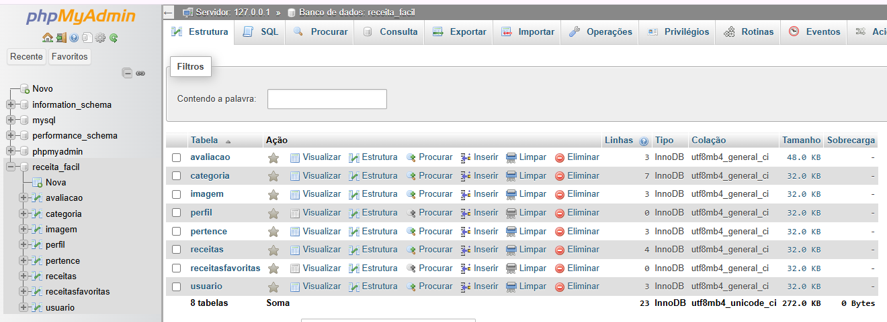
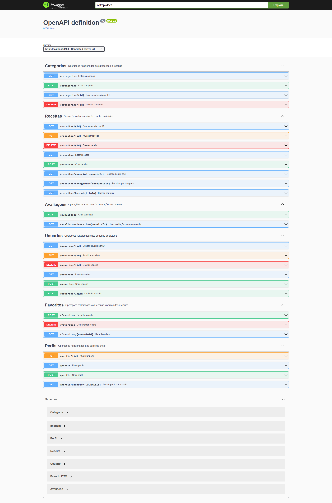
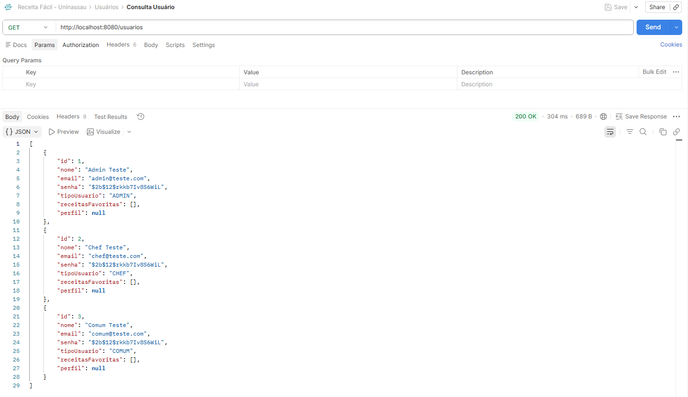
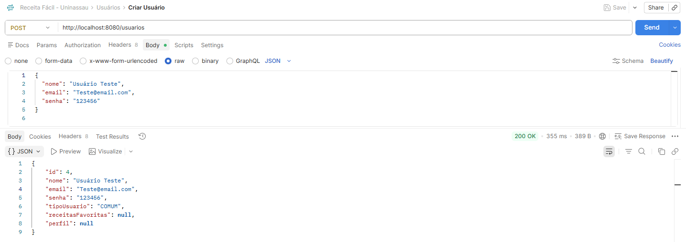
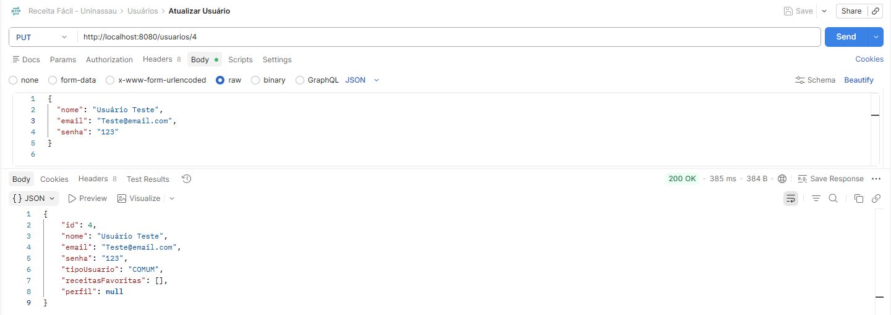
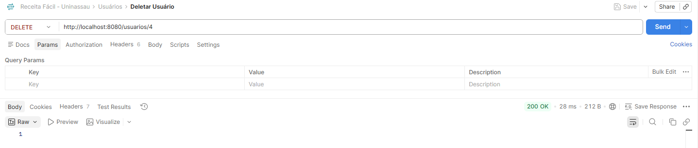

<h1 align="center">
  
   
  Receita Fácil
</h1>

<h4 align="center">
  Sistema de Descoberta e Compartilhamento de Receitas Culinárias
</h4>

  
  
  
  

  <a href="#-sobre-o-projeto">Sobre</a> •
  <a href="#-funcionalidades">Funcionalidades</a> •
  <a href="#-tecnologias">Tecnologias</a> •
  <a href="#-arquitetura-e-banco-de-dados">Arquitetura</a> •
  <a href="#-design-e-documentação">Design & Docs</a> •
  <a href="#-como-executar-e-testar">Como Executar</a> •
  <a href="#-como-testar-a-api">API & Swagger</a> •
  <a href="#-autores">Autores</a>

---

## 🍽️ Sobre o Projeto

No cenário atual, a busca por receitas culinárias na internet é fragmentada e pouco intuitiva, muitas vezes frustrando o usuário com excesso de texto e pouca personalização. 

O **Receita Fácil** surge como uma solução inovadora que centraliza a descoberta, criação e compartilhamento de receitas. Inspirado na facilidade de uso de apps de relacionamento (sistema de *swipe*) e de delivery (busca *search-as-you-type*), o projeto tem como objetivo proporcionar uma experiência moderna, interativa e sem fricções.

Este projeto é resultado do **Projeto Integrado** do 3º Semestre de Análise e Desenvolvimento de Sistemas do **Centro Universitário Maurício de Nassau (UNINASSAU) - Caruaru**.

## 🚀 Funcionalidades

- **Descoberta Intuitiva (Swipe):** Sistema de deslizar cards para encontrar a receita ideal para o seu dia.
- **Busca em Tempo Real:** Filtros inteligentes por categorias e ingredientes enquanto você digita.
- **Gestão de Perfil:** Sistema com perfis variados (`Comum`, `Chef` e `Admin`).
- **Criação de Conteúdo:** Chefs podem publicar, editar e gerenciar suas próprias receitas.
- **Favoritos e Biblioteca:** Salve as receitas que mais gostar para não perder de vista.
- **Avaliações e Comunidade:** Dê feedback, notas e comentários nas receitas testadas.

## 💻 Tecnologias

A stack de tecnologia do projeto foi escolhida para entregar máxima performance e robustez:

* **Frontend:** [React Native](https://reactnative.dev/) (Framework Cross-platform) e Expo
* **Backend:** [Spring Boot / Java](https://spring.io/projects/spring-boot) (API REST)
* **Banco de Dados:** [MySQL](https://www.mysql.com/) (Relacional)

## 🗄️ Arquitetura e Banco de Dados

A modelagem do banco de dados relacional foi normalizada até a **3ª Forma Normal (3FN)**. O banco de dados suporta múltiplas funcionalidades principais através de relacionamentos complexos:

- **Usuários e Perfis (1:1):** Um usuário comum pode se transformar em um Chef, ganhando um `Perfil` adicional com especialidades.
- **Receitas (1:N):** Um Chef publica múltiplas `Receitas`.
- **Categorias e Imagens (N:N e 1:N):** As receitas são classificadas em várias categorias simultaneamente e suportam uma galeria de fotos.
- **Avaliações e Favoritos (N:N):** A comunidade interage ativamente, linkando múltiplos usuários a múltiplas receitas.

### DER do Banco de Dados

---

## 🎨 Design e Documentação

- **Figma Original do Projeto:** [Acessar o Figma Interativo](https://www.figma.com/make/H2spizXgTVjxh9maa9Dh9H/Receita-F%C3%A1cil?p=f&fullscreen=1)
- **Documentação em PDF:** [Projeto Receita Fácil - Uninassau - ADS 3º _B_.pdf](./arquivos/Projeto%20Receita%20Fácil%20-%20Uninassau%20-%20ADS%203º%20_B_.pdf)

---

## 📱 Como Executar e Testar

### Passo 1: O Banco de Dados (O Cofre)
1. Abra o seu **XAMPP**, ligue o Apache e depois o **MySQL**. Em seguida, aperte em "Admin" na linha do MySQL.
2. Abra o navegador e acesse `http://localhost/phpmyadmin`.
3. Vá na aba **"Importar"**, selecione o arquivo `database/receita_facil.sql` e aperte em **Executar** no final da página.

**Contas Padrão (Criadas pelo Script DB):**
* Admin: `admin@teste.com` | Senha: `123` *(Acesso Administrativo)*
* Chef: `chef@teste.com` | Senha: `123` *(Posta receitas)*
* Comum: `comum@teste.com` | Senha: `123` *(Visualiza e favoritar)*

### Passo 2: Ligar o Backend (Spring Boot)
1. Abra o seu terminal e entre na pasta do backend: `cd backend`
2. Digite o comando para ligar o servidor Java: `./mvnw spring-boot:run`
3. Se aparecer `Tomcat started on port 8080`, **Sucesso!** 

**Acesse o Backend Ativo no Navegador:** 
👉 **[http://localhost:8080/](http://localhost:8080/)**

### Passo 3: Ligar o Frontend (React Expo)
1. Abra **outra janela** de terminal e entre na pasta do frontend: `cd frontend`
2. Digite o comando para ligar o aplicativo: `npx expo start --tunnel --clear`
3. O terminal vai perguntar se você quer logar. Pressione a **Seta para Baixo** no teclado para selecionar `Proceed Anonymously` e aperte **Enter**.
4. Um QR Code gigante vai aparecer na tela.

### Passo 4: Escolha como quer Testar (PC ou Celular)

**Opção A: No Computador (Web - Mais Rápido)**
* No mesmo terminal onde está o QR Code, aperte a letra **`w`** no seu teclado.
* Uma janela do navegador será aberta automaticamente com o aplicativo rodando simulado no PC.
* *Nota:* No PC, o `localhost` costuma funcionar sem problemas, então não é necessário trocar o IP.

**Opção B: No Celular (O Teste Real no iPhone/Android)**
Se você for testar no **celular físico (Expo Go)**, o `localhost` não vai funcionar porque o celular e o PC têm endereços diferentes. Você precisa apontar o código para o **IP da sua máquina**:
1. **Descubra seu IP**: No terminal do seu PC, digite `ipconfig` e procure o "Endereço IPv4" (ex: `192.168.100.145`).
2. **Troque no Código**: Abra o arquivo `frontend/src/services/api.ts` e altere a `BASE_URL`:
   `const BASE_URL = 'http://SEU_IP:8080';`
3. Abra o aplicativo **Expo Go** no seu celular e leia o QR Code na tela do PC.
4. **Importante**: Celular e computador devem estar na **mesma rede Wi-Fi**.

---

## 🧪 Como Testar a API & Swagger

A API REST do backend está totalmente documentada e validada. Você pode testar todas as requisições de Usuários, Receitas e Categorias de duas formas:

### 1. Documentação Interativa (Swagger UI)
A forma mais fácil de testar o backend é diretamente pelo navegador através do Swagger. Com o backend rodando, acesse:
👉 **[http://localhost:8080/swagger-ui/index.html](http://localhost:8080/swagger-ui/index.html)**

### 2. Endpoints Principais (Exemplo de Usuários)

**GET /usuarios**

**POST /usuarios**

**PUT /usuarios/{id}**

**DELETE /usuarios/{id}**

---

## 👨‍💻 Autores

- **Allan Victor Morais de Lima** - *01813117*
- **Gabriel Henrique da Silva** - *01777141*
- **Pedro Francisco Alves Neto** - *01864946*
- **Vinicius Santos Cansanção** - *01813852*

 

Feito com 👨‍🍳 para o UNINASSAU - 2026.

